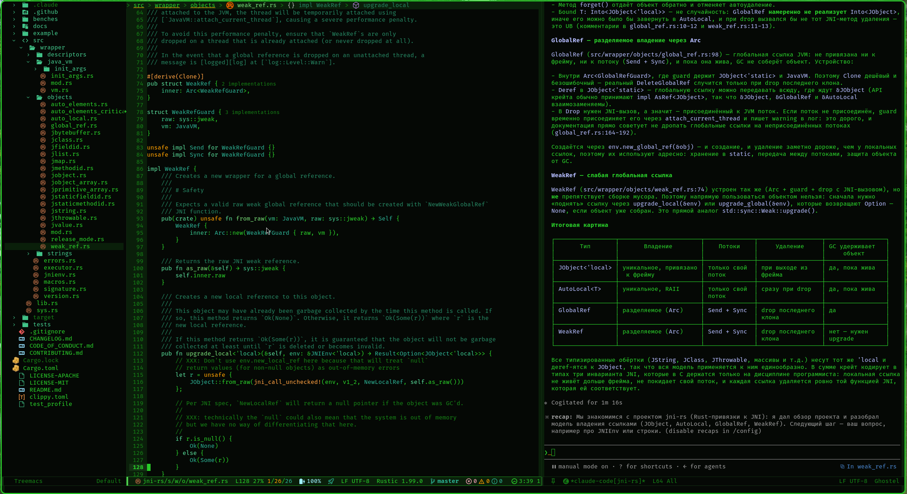

# Emacs configuration

*Русская версия: [README.md](README.md).*

Modular configuration for Emacs 30+. Packages install themselves on
first launch (`use-package` + `:ensure`, GNU/NonGNU ELPA and MELPA
archives).



*The “green phosphor” theme: Treemacs on the left, Rust (rustic +
lsp-mode) in the middle, a Claude Code session (claude-code-ide) in the
ghostel terminal on the right.*

## Installation on a fresh machine

```sh
git clone https://github.com/tarigo/dotfiles-emacs.git ~/.config/emacs
emacs   # packages install themselves on first start
```

Local copilot (requires llama.cpp and FIM models in `~/models`,
see “Highlights”):

```sh
ln -s ~/.config/emacs/systemd/llama-fim-*.service ~/.config/systemd/user/
systemctl --user daemon-reload
systemctl --user enable --now llama-fim-qwen
```

Note: `systemctl --user disable` also removes the unit symlink itself —
recreate it (`ln -s` above) before enabling again.

The list of selected packages (`package-selected-packages`) accumulates
in the local `custom.el` as packages get installed — the file is not
tracked by git, so `M-x package-autoremove` is safe on any machine.

## System requirements

### System

- **Emacs 30+** built with dynamic modules and SQLite
  (the standard Arch packages `emacs`/`emacs-wayland` qualify):
  modules are needed by the ghostel terminal, SQLite by the org-roam
  database.
- **git** — magit and installing packages from git (`package-vc`:
  claude-code-ide).
- **systemd user session** — the local copilot units.
- **Login-shell PATH**: tools outside the system PATH
  (`~/.local/bin`, rustup) must be set up in `.zshenv`/`.zprofile` —
  the Emacs daemon gets its PATH from there (exec-path-from-shell).
- **Internet on first launch**: ELPA/MELPA, GitHub
  (claude-code-ide) and downloading the ghostel module.

### Fonts

- **FiraCode Nerd Font** (`ttf-firacode-nerd`) — the default font.
- If nerd-icons render as squares —
  `M-x nerd-icons-install-fonts` (installs Symbols Nerd Font Mono).

### Packages

| Tool | Arch package | Purpose |
|---|---|---|
| rust-analyzer | `rustup component add rust-analyzer` | LSP for Rust |
| clangd, clang-format | `clang` | LSP and C/C++ formatting |
| zig, zls | `zig`, `zls` (versions must match) | LSP and zig fmt |
| kotlin-language-server | manually into `~/.local/bin` | LSP for Kotlin |
| graphviz (`dot`) | `graphviz` | org-roam note graph |
| pandoc | `pandoc-cli` | org export (`ox-pandoc`) |
| bear | `bear` | `compile_commands.json` for Makefile projects |
| claude (CLI) | Anthropic installer → `~/.local/bin` | claude-code-ide |
| llama.cpp (`llama-server`) | `llama.cpp-cuda` | local copilot |
| ledger | `ledger` | accounting (`ledger-mode`, reports) |
| Anki + AnkiConnect | optional | pushing cards from `study.org` |

### Local copilot — extras

- A GPU with ~4 GB VRAM — the unit parameters are tuned for that amount.
- Models in `~/models` under the exact names from the units:
  `Qwen2.5-Coder-3B-Q5_K_M.gguf` and `Mellum-4b-base.Q4_K_M.gguf`.
- The units start `llama-server` by absolute path `/usr/bin/llama-server`.

## Layout

```
early-init.el              — GC, read-process-output-max, disabling UI before the first frame
init.el                    — entry point: paths, load-path, module order
init.d/
  basics/
    package-management.el  — package archives, use-package
    environment.el         — login-shell PATH for daemon startup
    appearance.el          — modeline, font, dashboard, fallback themes
    phosphor-theme.el      — “green phosphor” theme (modus-vivendi + palette)
    editing.el             — windmove, undo-tree, company
    completion.el          — vertico, consult, embark, orderless, marginalia
  development/
    common.el              — lsp-mode/lsp-ui, flycheck, magit, treemacs, yasnippet
    rust.el                — rustic + rust-analyzer, clippy, rustfmt on save
    kotlin.el              — kotlin-mode + lsp
    c-cpp.el               — clangd (clang-tidy), cmake-mode
    zig.el                 — zig-mode + zls, zig fmt on save
    kdl.el                 — kdl-mode: zellij configs and other *.kdl
    claude.el              — claude-code-ide: Claude Code MCP integration
    ai-complete.el         — minuet: ghost text from a local FIM model (llama.cpp)
  productivity/
    init-org.el            — org: agenda, capture, refile, babel, clocking
    roam.el                — org-roam + org-roam-ui: knowledge base
    finance.el             — ledger-mode: plain text accounting
```

## Highlights

- **Shift-arrows** switch windows (windmove) — everywhere, including org:
  org commands on S-arrows are remapped to alternatives
  (`org-replace-disputed-keys`: `M-p`/`M-n`/`M--`/`M-+`).
- Backups, auto-saves, undo history and the org-roam DB live in
  `~/.cache/emacs/`.
- Org files live in `~/org/` (created on first launch); org-roam notes
  in `~/org/roam/`, separate from the agenda files.
- Format on save: Rust (rustfmt) and Zig (zig fmt) — yes;
  C/C++ — deliberately not (`M-x lsp-format-buffer` manually, honours
  the project's `.clang-format`).
- Org-babel blocks: emacs-lisp runs without confirmation,
  shell/python ask first.
- Treemacs opens only manually (`C-c t`), but then follows the current
  file and project on its own; `C-x o` never enters the tree.
- **Local copilot** (minuet): grey multi-line suggestions on top of the
  usual company/LSP; auto-suggestions stay hidden while the company
  popup is open. The backend is `llama-server` on `localhost:8012`,
  two systemd units in `systemd/` (symlinked into
  `~/.config/systemd/user/`, see “Installation”): `llama-fim-qwen`
  (Qwen2.5-Coder-3B base, autostart) and `llama-fim-mellum`
  (JetBrains Mellum-4b); mutual `Conflicts=` — only one fits in 4 GB
  VRAM. `M-x ai-complete-switch-model` switches the unit and the FIM
  prompt format together. On battery:
  `systemctl --user stop llama-fim-qwen` — minuet simply stays silent.

## Keybindings

### General

| Key | Action |
|---|---|
| `S-arrows` | switch windows |
| `F5` | theme: “phosphor” (modus-vivendi) ↔ light (modus-operandi) |
| `C-x g` | magit-status |
| `C-c t` | treemacs |
| `C-c C-'` | Claude Code menu |
| `C-c a` | org-agenda |
| `C-c c` | org-capture |
| `C-c o` | “Overview” agenda |

### Rust (rustic-mode, `C-c C-c …`)

| Key | Action |
|---|---|
| `M-j` | lsp-ui-imenu |
| `M-?` | find references |
| `C-c C-c l` | flycheck error list |
| `C-c C-c a` | code action |
| `C-c C-c r` | rename |
| `C-c C-c q` / `Q` | restart / shut down LSP |
| `C-c C-c s` | rust-analyzer status |

### Local copilot (minuet)

| Key | Action |
|---|---|
| `F6` | toggle auto-suggestions (global; `M-i` always works) |
| `M-i` | request a suggestion manually |
| `TAB` | accept the suggestion in full (while it is on screen) |
| `M-a` | accept only the first line |
| `M-n` / `M-p` | another suggestion variant |
| `M-e` | dismiss the suggestion |

### Knowledge base (org-roam, `C-c n …`)

| Key | Action |
|---|---|
| `C-c n f` | find/create a note |
| `C-c n i` | insert a link to a node |
| `C-c n c` | capture into a note |
| `C-c n l` | backlinks |
| `C-c n g` | graph (graphviz) |
| `C-c n t` / `a` | tag / alias |
| `C-c n j` / `d` | journal: new entry / today |
| `C-c n u` | org-roam-ui: graph in the browser (localhost:35901) |

### Org capture templates (`C-c c`)

`t` task → inbox · `m` meeting · `w` workout ·
`s` shopping · `l` study card (study.org, anki-editor format) ·
`e` / `i` expense / income (ledger) · `j` journal

## Notes

- `.gitignore` works as a whitelist: a new configuration file must be
  explicitly added with a `!/name` line.
- Local and work-specific settings go into `private.el` at the config
  root: init.el loads it when present, and git never picks it up (not
  in the whitelist). The same place is for personal values of the
  finance.el variables (`my/ledger-expense-categories`, accounts,
  currency) and private capture templates.
- `custom.el` also lives at the root, untracked: only Custom and
  package.el (the selected-packages list) write there.
- LSP: if a project refuses to open, check whether its root
  (or `~/`!) ended up in the blocklist —
  `M-x lsp-workspace-blocklist-remove`.
